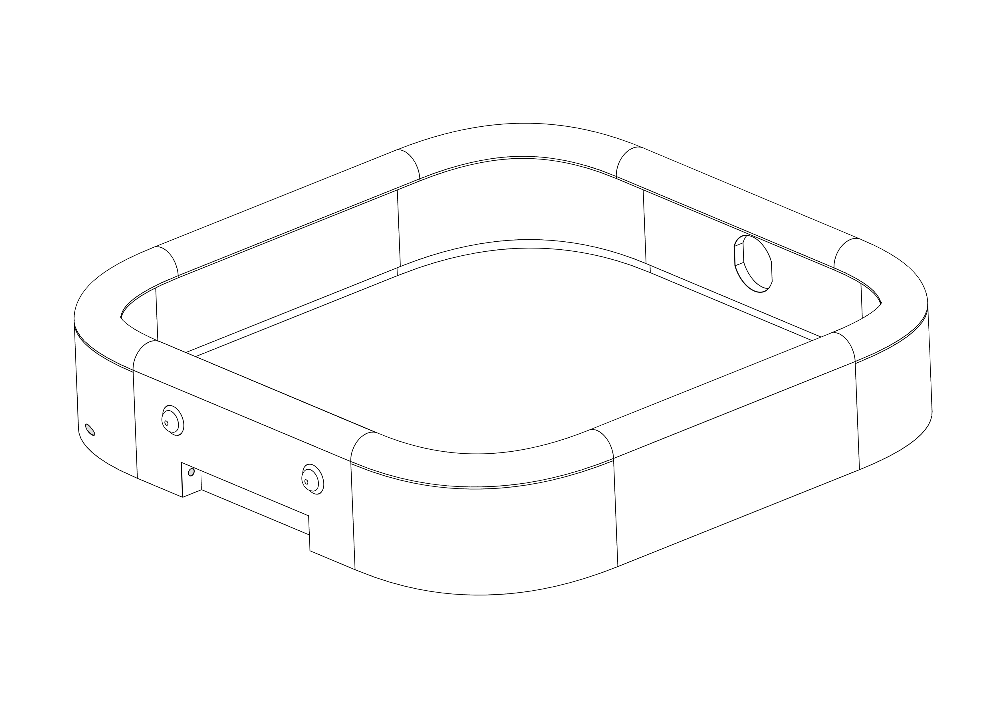
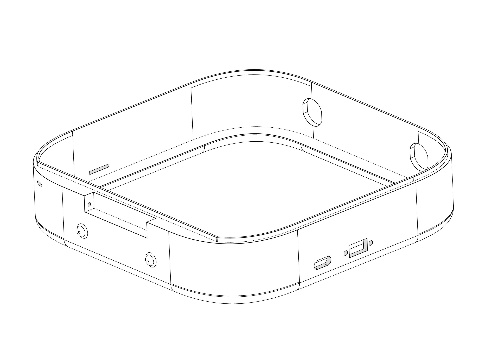
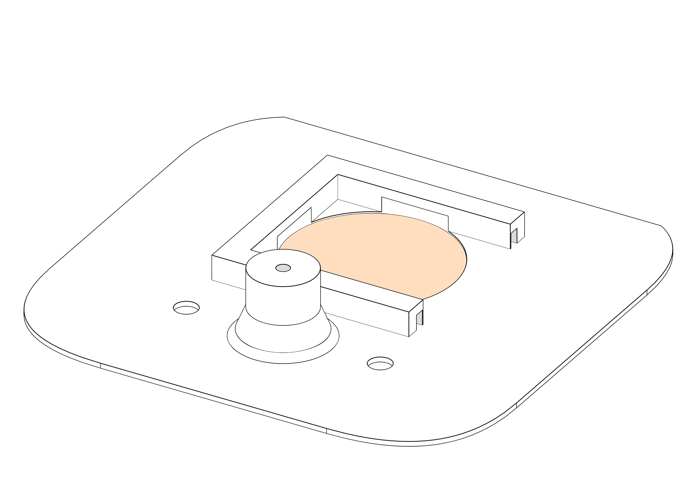
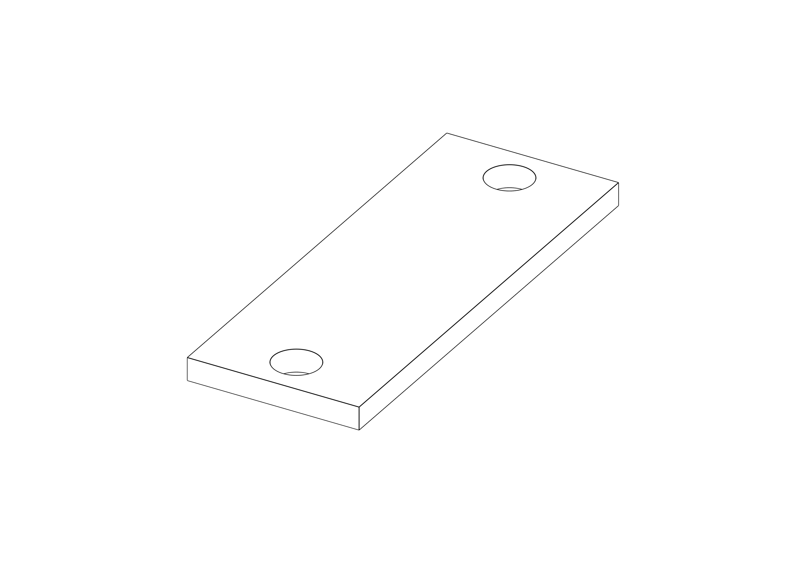

# LittleSpeaker

This is the Git-Repository for the LittleSpeaker Project. The idea is to build
a small mono speaker that is repairable, hackable and can do some more advanced things
than just being a Bluetooth speaker.

Design of the enclosure is by Jennifer Leis, Firmware and electronics by me.


## Enclosure

The prototype enclosure was 3D printed and is held together by a hinge and just one
M3 screw.

You will need:

1. 1x [Front bezel](enclosure/front-bezel.step)
   
2. 1x [Back bezel](enclosure/back-bezel.step)
   
3. 1x [Back plate](enclosure/back-plate.step)
   
4. 1x [Front plate](enclosure/front-plate.step)
   
5. 1x [Hinge](enclosure/hinge.step)
   
6. 2x [Knob](enclosure/knob.step)
   
7. Two small pieces of wood or plastic as holding braces for the PCBs
   that will be accessible from the outside (15 x 40mm two M3 trough holes)
   
8. Brass hotmelt inserts for screwing the front and back together and for the braces:
   - 1 x M3x6
   - 4 x M3x4
   
9. 5x M3x10 Cap head screws
10. Some self-tapping screws to attach the power switch.
11. A piece of Copper wire to fit into the hinge to connect the front and back pieces
12. Glue to glue the front and back plates into the bezels and some foam rubber strips
    or foam tape for securing stuff
13. Some wool or cotton to fill the empty spaces so no wires rattle around.

When printing the front plate make sure to change the settings for the speaker grille
part to not print any bottom or top layers, use hexagon/honeycomb infill and use about 
40% infill strength. You can remove the speaker grille part if you want to have the
speaker open like you can see in the rendered graphic of the assembly.

After printing:

1. Remove the supports from the holding brackets of the speaker driver.
   There should be thin walled supports that have been designed into the part.
2. Melt the inserts into the brace holes and the front plate.
3. Glue the front and backplates into their bezels
4. Find a piece of copper wire that fits into the holes in the hinge.
   The front and back bezels both have a small hole through which you can insert
   the wire through the hinge part. If assembled and the hinge is freely rotating
   you can use a small screw driver to bend the wire in the hole to avoid it falling out.
   Alternatively insert a dab of glue to close the hole.
5. The SD card slot and USB-C port probably need some cleanup and filing to fit perfectly.

## Electronics

The electronics in this devices are meant to be modular, so developer boards for all
components were used and the wiring connections mostly have dupont connectors to be able
to remove/replace a component without de-soldering anything. You can of course skip the
connectors and solder everything together, that's your choice.

### BOM

- DFRobot Firebeetle 2 ESP32-E (ESP32 development board with battery charger and USB-C)
  
- I2S DAC usually something like a `PCM5102A`
  
- Micro SD Card reader, see below for more instructions!
  
- Class D Amplifier for 1.5W to 4W with volume regulation, for example `PAM8403`
  
- "57mm Speaker" (yes this is the search term). You can probably use any speaker you
  want as long as it is 4-8 Ohms and can work with your amplifier.
  
- LiIon 18650 Battery
  
- Battery holder
  
- 3x Round pushbutton. If you cannot find these, you probably can use others if you
  have some patience and a file for the holes ;)
  
- Sliding switch for power
  
- Encoder with pullups, you can get modules that have pullups integrated, if you
  have no pullups integrated you can integrate resistors in your wiring.
  **Attention:** this is not a potientometer but a gray encoder!
  
- 3 x 1kOhm resistor as pull up for the buttons
- Some multi colored wires, a soldering Iron and patience

**SD-Card reader:**

Get a reader that has the Card slot as close to the edge as possible, if it is not at the
edge you can usually file away some of the FR4 board to make it fit. (Usually there are no traces there to destroy...).

Most SD-Card readers you can get on the market are designed to be used with 5V electronics
and contain a linear regulator (red X) to step down that voltage to 3.3V. As the ESP32
works on 3.3V already you'll have to remove that LDO because the minimal voltage it needs
to run is usually 4.5V. When removing the part either use hot air or just a soldering
iron and cook  that thing, as we won't be needing it you do not have to save it. After
removal just bridge input and output of the part (marked in green).


### Wiring


Open the [Schematic](electronics/schematic/outputs/schematic.pdf)


Make sure to connect the Amplifier directly to the battery and **not** the ESP32. You will crash the ESP with loud music as the regulator on the PCB will not deliver enough power!

For the button pullup resistors I soldered them in-line with a wire and applied heatshrink over them (greenish heatshrink in the photo).

The development boards are glued with double sided tape and if needed you can apply the braces on top and stuff them with some foam tape or something rubbery to hold the boards down firmly.

The Speaker will slide into the printed rails but it will rattle around, you need some
foam tape or foam rubber strips to wedge the speaker into.

## Firmware

The firmware is in this repository and is to be built with platform.io

The Arduino framework is used and these external libraries:

- ESP8266Audio 1.9.7 (Audio components)
- RotaryEncoder 1.5.3 (Encoder knob)
- AceButton 1.10.1 (Buttons)
- FixedPoints 1.1.2 (3 Band Equalizer)

Just open this repository in a Platform.io IDE of your choice and click "Build and Upload"

### Stuff you may want to change

**SD-Card read speed**

If you get errors on the serial debug console output about the SD-Card not working, you may have a slow SD-Card, go to `src/main.cpp` around line 35 and change the following line:

```cpp
#define SPI_SPEED 4000000u
```

40 MHz is the default and the maximum speed the ESP32 can handle. Try reducing to 20MHz
or 15 MHz until the SD-Card works. If you go too slow sound will be crackling and boot
times will increase.

**Equalizer settings**

As the EQ settings depend on the materials you printed the enclosure, print settings and
the used speaker driver you probably want to play with those settings a bit. You can find
them in `src/main.cpp` at around line 150.

Search for these lines:

```cpp
  eq = new AudioOutputFilter3BandEQ(output, 500, 5000);
  eq->setBandGains(1.5, 0.9, 1.3);
```

The first line sets the cutoff frequency of the EQ bands, so in this example we have 3
Bands:

- 0-500 Hz
- 500-5000 Hz
- 5000-22050 Hz

Those values are approximate as the algorithm implemented for the EQ is very simple and
not accurate at all, but as we're dealing with very simple and cheap components here it is
usually ok to use that.

The second line sets the equalizer band gains. If you set them all to *1.0* you should 
hear the original sound. I recommend to use values in the range of *0.75* to *1.5*. If you
go under or over those the sound may distort or clip, I warned you!

## SD-Card

To properly function the speaker needs an SD-Card to store voice prompts and 
configuration. I personally tried with 16GB SD-Cards and it worked fine (those were the
smallest cards i could get from my supplier), I think that is enough space for this project as two full days of music are just under 4GB and if you put too many directories
on there the boot time of the device will take ages as it needs to build an index of the
contents on boot up.

To prepare the SD-Card for the speaker:

1. Format the SD-Card to FAT32
2. Put all files from the `sd-card` folder directly onto the SD-Card
3. Read the [Readme](sd-card/README.md) of the SD-Card for more information